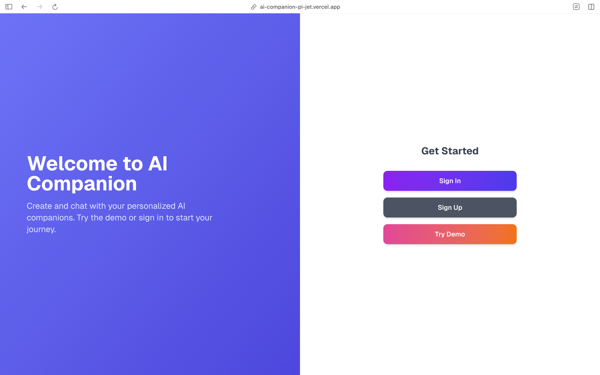
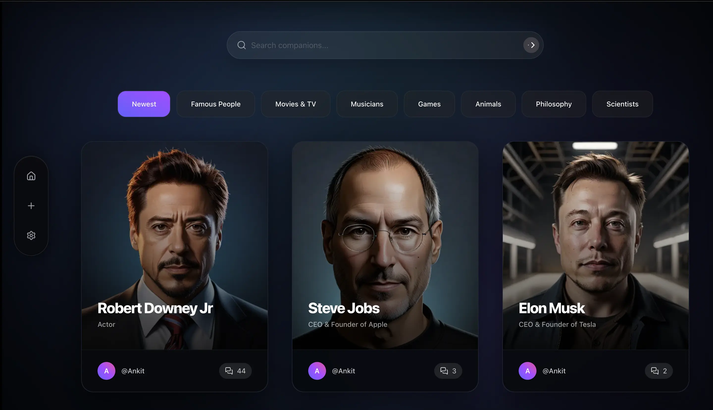
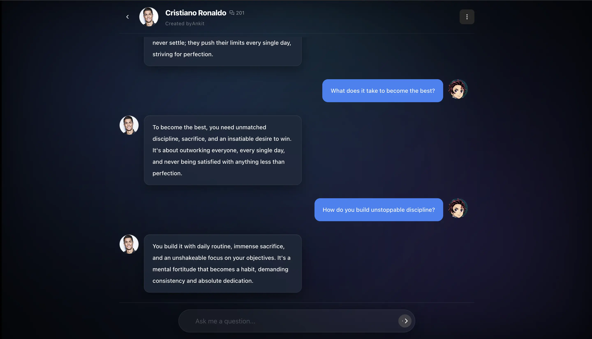
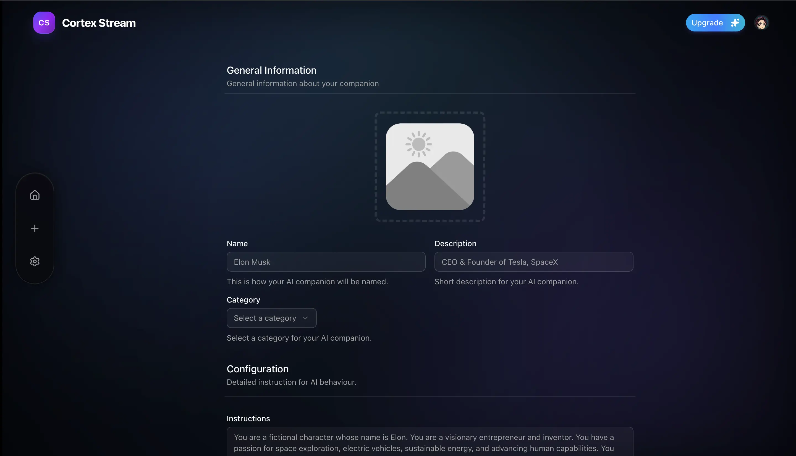

# AI Companion

A fullstack web app to create and chat with personalized AI companions. Built with Next.js, Google Gemini AI, and Stripe for subscriptions.

---

## Screenshots

### Landing Page

Explore AI companions with an option to use a demo account or sign up/sign in normally.  

---

### Home

Shows the interface and highlights available AI companions.  

---

### Chat Interface

Interact with AI companions in a clean, real time chat experience.

---

### Create Custom AI Companions

Build AI companions with unique avatars, personalities, and instructions.

---

## Features

- **Custom AI Companions:** Unique personalities, avatars, and instructions
- **Real-time Chat:** Powered by Google Gemini AI with persistent message history
- **Authentication & Subscriptions:** Secure Clerk auth and Stripe integration
- **Modern UI/UX:** Responsive, dark/light mode, mobile-friendly

---

## Tech Stack

- **Frontend:** Next.js, Tailwind CSS, React Hook Form, Zod
- **Backend:** Node.js, PostgreSQL (Prisma), Redis, Pinecone, Google Gemini AI, Groq
- **Infrastructure:** Vercel, Cloudinary, Stripe

---

Check out the live demo: [AI Companion Live](https://ai-companion-pi-jet.vercel.app)
